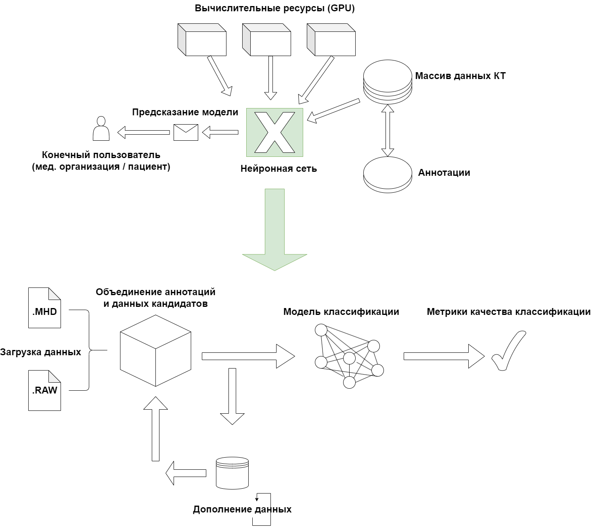
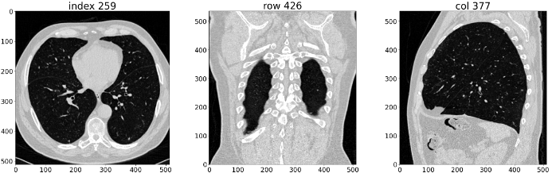
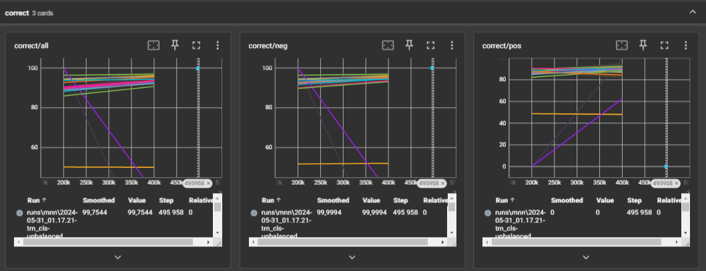
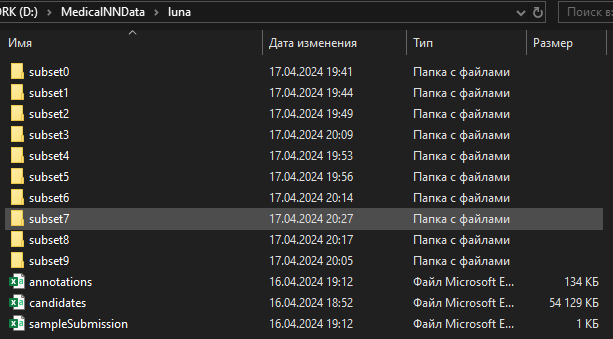

# Medical neural network
## Раннее выявление рака легких с помощью нейронной сети
***
### Участники:
Бендрышев Сергей Александрович, группа 5130904/10103 \
Шульгин Илья Константинович, группа 5130904/10103 \
Бурычкин Матвей Олегович, группа 5130904/10103

### Описание проекта

1) Целью проекта является разработка модели нейронной сети для раннего выявление рака легких с использованием снимков компьютерной томографии.
2) Выработка требований
    - Объединение источников данных (снимки компьютерной томографии LUNA) - часть 1 доступна по ссылке https://zenodo.org/records/3723295, часть 2 по ссылке https://zenodo.org/records/4121926 (общий объём данных ~111 ГБ).
    - Обучение модели классификации обнаружению потенциальных опухолей
    - Улучшение процесса обучения с помощью метрик и дополнений.
3) Разработка архитектуры и детальное проектирование доступны по ссылке\
    https://drive.google.com/file/d/1vkO2NkZX6lx-bMfv_RzRBXSECjyeesm4/view?usp=sharing
    
4) Распределение обязанностей
    - Сергей - обучение модели классификации
    - Илья - объединение источников данных
    - Матвей - запуск процесса обучения модели и предоставление результатов тестов
5) В качесвте юнит-тестов представлена визуализация данных в ноутбуках explore_data и augmented_explore_data. Фрагмент визуализации:
    
6) В качестве интеграционного тестирования представлен ноутбук run_everything_augmented, при выполнении которого были получены данные в runs/mnn/. Результаты тестирования представляют собой метрики для TensorBoard. Фрагмент визуализации метрик с помощью TensorBoard:\
    
7) Сборка проекта есть в двух вариантах
   - Docker \
   Сборка образа: `docker-compose build --build-arg KEY="cuda"`\
   Аргумент отвечает за возможность использования видеокарты при обучении модели. Для корректной работы требуются соответствующие драйвера видеокарт. Возможные параметры сборки: cuda, rocm, cpu.\
   Запуск контейнера: `docker-compose up -d`\
   В контейнере запускается Jupyter Notebook, доступ к которому осуществляется по адресу `127.0.0.1:8888`. Для корректной работы предварительного кэширования данных требуется большой объём свободного места (~180 ГБ для полного набора), этот параметр задаётся в файле compose.yaml и изначально равен 30 ГБ. \
   Тестирование нейронной сети и её использование осуществляется через Jupyter Notebook.

   - Makefile
    Есть несколько опций 
        1) install-deps - установка зависимостей (за исключением torch, для него есть отдельный dockerfile)\
        Запуск производится командой make install-deps.
        2) prepcache - запуск предварительного кеширования данных для обучения модели\
        Запуск производится командой make prepcache.
        3) train - запуск обучения модели\
        Запуск производится командой make train.\
        Для того чтобы произвести этапы поочередно, можно запустить все одной командой make.

    Датасет LUNA должен быть скачан (все subset* полностью или частично) в папку luna как на изображении:
   \
   Путь до папки luna должен храниться в переменой окружения PARTICIPANT_DATA_PATH.\
   Например, PARTICIPANT_DATA_PATH=D:/MedicalNNData/

***
